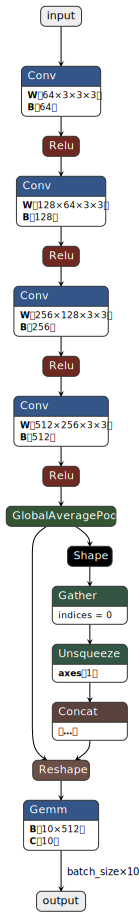

# Example inference script of TensorRT(Python)

This is example inference script of TensorRT.  
I checked on the following environment.

- reComputer J4012(Jetson Orin NX 16GB)
- JetPack 5.1.2
- TensorRT 8.5.2
- cuda-python 12.2.0
- onnxruntime-gpu 1.15.1
  - <https://elinux.org/Jetson_Zoo#ONNX_Runtime>

## Preparation

### create ONNX model

I created `model/model_bn.onnx`. This model was generated using the following steps.  
<https://github.com/NVIDIA-AI-IOT/jetson_dla_tutorial>



### install cuda-python

I installed [cuda-python](https://nvidia.github.io/cuda-python/index.html) to use CUDA Toolkit.

```shell
pip install cuda-python==12.2.0
```

### Build TensorRT Engine

Please build engine by TensorRT.

```shell
trtexec --verbose --profilingVerbosity=detailed --buildOnly --memPoolSize=workspace:8192MiB --onnx=model/model_bn.onnx --saveEngine=model/model_bn.onnx.engine > model_bn.onnx.engine.build.log
```

If you use DLA(Deep Learning Accelerator), please add `--useDLACore` option.

```shell
trtexec --verbose --profilingVerbosity=detailed --buildOnly --memPoolSize=workspace:8192MiB --onnx=model/model_bn.onnx --saveEngine=model/model_bn.onnx.engine --useDLACore=0 --allowGPUFallback > model_bn.onnx.engine.build.log
```

## Inference

I created `trt_infer.py` to infer using TensorRT Engine.

### import TensorRT and cuda-python

```python
import tensorrt as trt
from cuda import cudart
```

### deserialize TensorRT Engine

```python
logger = trt.Logger(trt.Logger.INFO)
runtime = trt.Runtime(logger)
trt_engine_file = 'model/model_bn.onnx.engine'
with open(trt_engine_file, 'rb') as f:
    engine_bytes = f.read()
    engine = runtime.deserialize_cuda_engine(engine_bytes)
```

### create context

```python
context = engine.create_execution_context()
```

### inference

```python
bindings = [d_input_npa_ptr, d_output_npa_ptr]
context.execute_async_v2(bindings, stream)
```

## Result

### ONNX Runtime(CPUExecutionProvider)

```shell
$ python3 ort_infer.py 
[[-0.00903677 -0.01994101 -0.00086907  0.00596721  0.01973673  0.00928676
  -0.03634664  0.02087523  0.02591487  0.00518102]]
```

### TensorRT(without DLA)

```shell
$ python3 trt_infer.py 
[08/28/2023-14:46:48] [TRT] [I] Loaded engine size: 6 MiB
[08/28/2023-14:46:49] [TRT] [I] [MemUsageChange] TensorRT-managed allocation in engine deserialization: CPU +0, GPU +5, now: CPU 0, GPU 5 (MiB)
[08/28/2023-14:46:49] [TRT] [I] [MemUsageChange] TensorRT-managed allocation in IExecutionContext creation: CPU +0, GPU +1, now: CPU 0, GPU 6 (MiB)
[[-0.0090362  -0.01994125 -0.00086519  0.0059704   0.01974285  0.00928105
  -0.03634467  0.02087708  0.0259134   0.00517914]]
```

### TensorRT(with DLA)

```shell
$ python3 trt_infer.py 
[08/28/2023-14:49:32] [TRT] [I] Loaded engine size: 3 MiB
[08/28/2023-14:49:32] [TRT] [I] [MemUsageChange] TensorRT-managed allocation in engine deserialization: CPU +3, GPU +0, now: CPU 3, GPU 0 (MiB)
[08/28/2023-14:49:32] [TRT] [I] [MemUsageChange] TensorRT-managed allocation in IExecutionContext creation: CPU +0, GPU +0, now: CPU 3, GPU 0 (MiB)
[[-0.0090332  -0.01992798 -0.00086403  0.00596619  0.01971436  0.00928497
  -0.03634644  0.02087402  0.02590942  0.00518417]]
```

## Reference

- <https://docs.nvidia.com/deeplearning/tensorrt/developer-guide/index.html>
- <https://docs.nvidia.com/deeplearning/tensorrt/api/python_api/index.html>
- <https://nvidia.github.io/cuda-python/index.html>
- <https://github.com/NVIDIA-AI-IOT/jetson_dla_tutorial>
- <https://github.com/PaddlePaddle/PaddleDetection/blob/release/2.6/deploy/end2end_ppyoloe/cupy-python.py>
